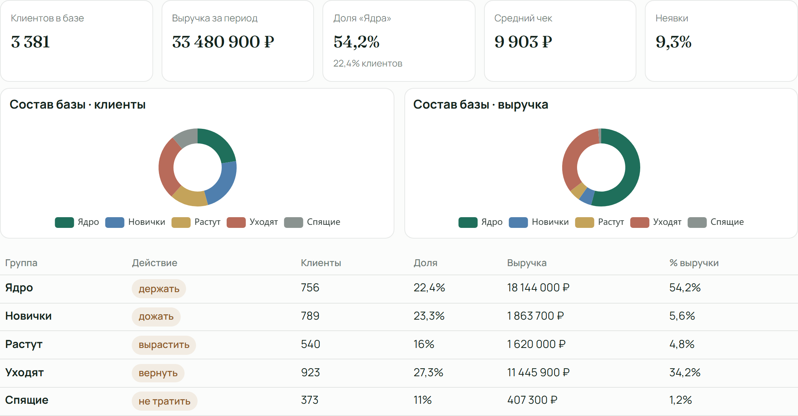
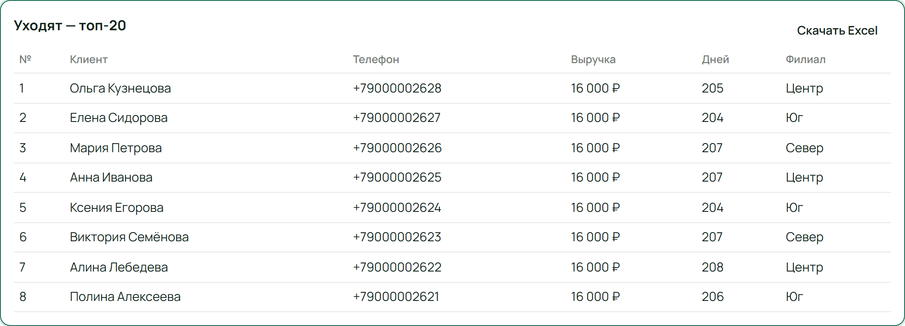
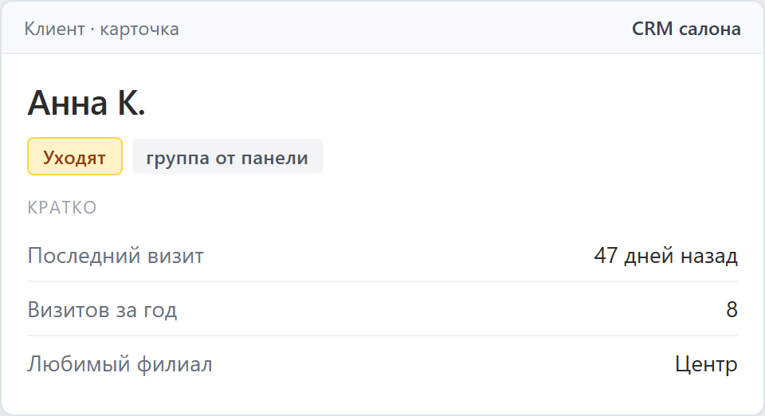
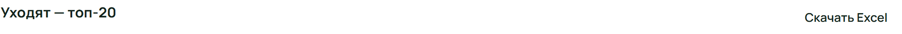

# AI-маркетолог для салона красоты · коммерческое предложение

## Кто реально приносит прибыль вашему салону?

Программа разбирает базу YClients и показывает, кто из тысяч клиентов приносит деньги, а кого ваш салон теряет.

[Открыть демо](https://ai-manager-beauty.maximrafikov.ru/#dashboard) · [Telegram @mxm_r](https://t.me/mxm_r) · [+7 917 389-99-83](tel:+79173899983)

**Стоимость:** от 50 000 ₽, точная цена после оценки базы  
**Срок:** 1–2 недели

## Знакомо?

Салон работает не первый год, база большая, точек несколько. А выручка стоит на месте или падает, расходы растут.

Вы платите маркетологу и за рекламу. Маркетолог снова просит бюджет на новых клиентов. Но кто из гостей приносит деньги — не знает ни он, ни вы.

Можно бесконечно привлекать новых. А можно собрать постоянную базу и знать, как с ней работать.

## Как это было в Sisters, Уфа

Мы разобрали базу сети салонов Sisters за 3 года. Около 20% постоянных клиентов принесли около 80% выручки.

Вывод для Sisters: бюджет выгоднее тратить на удержание тех, кто приносит деньги, чем на привлечение новых. Когда запись забита новичками, постоянным некуда записаться — и они уходят.

В вашем салоне цифры будут свои. Диагностика базы покажет, какие именно.

## Сначала диагностика, потом решения

Как с машиной: сначала диагностика, потом ремонт. Панель разбирает вашу базу и показывает, кто приносит выручку, а кто уходит.

*Сводка для владельца: сколько гостей в каждой группе и сколько выручки они приносят.*

Каждый гость попадает в одну из групп:

- **Ядро — постоянные клиенты.** Ходят часто и приносят основную выручку. Их держим.
- **Новички.** Были один-два раза. Доводим до второго визита.
- **Растущие.** Ходят всё чаще. Помогаем стать постоянными.
- **Уходят.** Раньше ходили регулярно, теперь пропали. Возвращаем.
- **Спящие.** Давно не были. На них не тратим бюджет.

## Что нужно сделать: увидеть → выбрать → связаться

**Увидеть.** Панель показывает каждую группу и сколько денег она приносит.

**Выбрать.** Берём короткий список: постоянные без следующей записи, уходящие, новички без второго визита.

**Связаться.** Администратор звонит по этому списку, а не обзванивает всю базу вхолостую.

*Готовый список группы «Уходят»: кому администратор звонит сегодня.*

## Что получает владелец

### Ярлыки в YClients — автоматически

Программа сама проставляет группу каждому клиенту в карточке YClients. Без панели сотрудникам Sisters пришлось бы вручную поставить ярлыки примерно 2000 гостям. Панель делает это сама.

Администратор открывает карточку и сразу видит: постоянный клиент перед ним или уходящий.

*Так администратор увидит группу клиента в карточке YClients.*

### Собственнику

Сводка по группам и выручке за год — по каждому филиалу и по сети целиком.

Показываем реальный размер базы. Убираем дубли: один гость с разных филиалов или записанный как 8… и +7… считается одним клиентом.

Берём три года истории. Кто не приходил дольше, только искажает картину.

### Управляющему

Списки по каждой группе: кого держать, кого возвращать, кого доводить до второго визита.

Отдельный список неявок: кто регулярно не приходит, отменяет и переносит. Для них стоит ввести предоплату.

### Администратору

Короткий список на смену вместо всей базы. Инструкция по работе с панелью и обучение.

*Любой список скачивается в Excel одной кнопкой — его можно сразу отдать администратору.*

## Как проходит внедрение

**1. Знакомство.** Разбираем ваш салон: филиалы, услуги, как сейчас работаете с базой.

**2. Согласование.** Настраиваем группы под ваш салон и вместе проверяем, кто куда попал. Ярлыки в YClients ставим только после вашего согласования.

**3. Интеграция с YClients.** Интегрируем панель с YClients, убираем дубли, загружаем три года истории.

**4. Передача.** Устанавливаем панель на компьютер салона, передаём инструкцию, обучаем администраторов и управляющего.

**Срок:** 1–2 недели.

## Стоимость

| Салон | Стоимость |
|---|---|
| Один салон | от 50 000 ₽ |
| 2–3 филиала | от 100 000 ₽ |
| 4 филиала и больше или крупная база | от 150 000 ₽ |

Цена зависит от размера базы. Точную называем после оценки.

**Оплата:** 50% при старте, 50% после передачи панели.

Без абонентской платы. Панель остаётся у вас.

**Срок:** 1–2 недели.

## Данные остаются у вас

Программа работает на компьютере салона. База клиентов не уходит в интернет — это защита от утечки.

Панель не заменяет YClients и не рассылает сообщения. Она показывает, кому и зачем позвонить.

## Следующий шаг

**Откройте демо.** Тур займёт 2 минуты: группы, списки на обзвон, выгрузка в Excel.  
[Открыть демо](https://ai-manager-beauty.maximrafikov.ru/#dashboard)

**Оставьте заявку.** Оценим вашу базу и назовём точную цену.  
[ai-manager-beauty.maximrafikov.ru](https://ai-manager-beauty.maximrafikov.ru)

**Напишите или позвоните.** Максим Рафиков  
Telegram: [@mxm_r](https://t.me/mxm_r)  
Телефон: [+7 917 389-99-83](tel:+79173899983)
